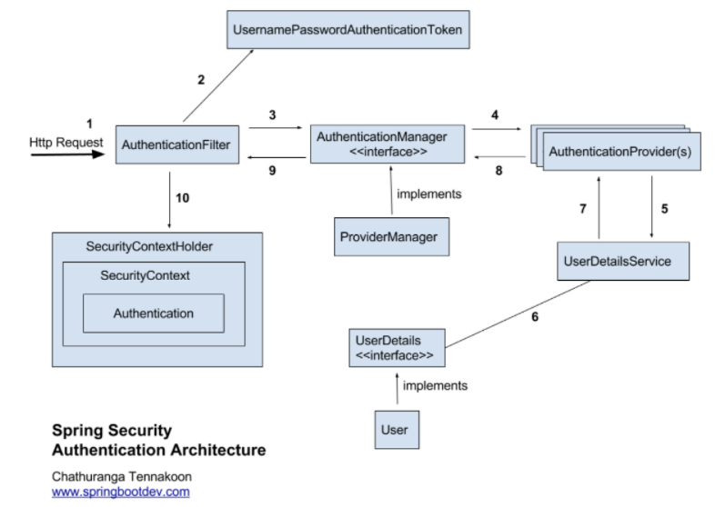

# 스프링 시큐리티(Spring Security)
- 스프링 시큐리티는 스프링 기반의 애플리케이션의 보안(인증과 권한관리, 인가 등)을 담당하는 프레임워크다.
- 인증(Authentication)과 인가(Authorization)를  담당하는 프레임워크다.
- 스프링 시큐리티는 서블릿 필터(Filter)와 이들로 구성된 필터체인으로 보안과 관련된 처리를 수행한다.

## 스프링 시큐리티의 주요 용어
- 접근 주체(Principal) : 보호된 리소스에 접근하는 대상(사용자)
- 인증(Authentication) : 보호된 리소스에 접근하는 대상이 누구인지, 애플리케이션의 작업을 수행해도 되는 주체인지 확인하는 과정
  - 예시) Form 기반 로그인
- 인가(Authorization) : 해당 리소스에 대한 접근 가능한 권한을 가지고 있는지 확인하는 과정(인증과정 이후에 수행한다.)
- 권한 : 어떠한 리소스에 대한 접근 제한, 모든 리소스는 접근 제어 권한이 걸려있으며, 인가과정에서 해당 리소스에 대해 제한된 최소한의 권한을 가졌는지 확인한다.

## 스프링 시큐리티의 사용자 인증 프로세스
<kbd></kbd>
1. 사용자가 로그인 정보를 서버로 보내고 인증을 요청한다.
2. **AuthenticationFilter**가 요청를 가로채고, 사용자가 서버로 보낸 로그인 정보를 통해 **UsernamePasswordAuthenticationTocken**(사용자가 입력한 로그인 정보를 기반으로 생성되며, 현 상태는 미검증 Authentication이다.) 객체를 생성한다.
3. **ProviderManager**(**AuthenticationManager** 구현체)에게 **UsernamePasswordAuthenticationToken**객체를 전달한다.
4. **AuthenticationProvider**에 **UsernamePasswordAuthenticationToken**객체를 전달함.
5. 데이터베이스로부터 사용자 인증 정보를 가져오는 **UserDetailsService**에 사용자 정보를 전달한다.
6. 전달받은 정보를 통해 데이터베이스에서 조회한 사용자로 **UserDetails**객체를 생성한다.
7. **AuthenticationProvider**는 **UserDetails**를 전달받고 사용자 정보를 비교한다.
8. 인증이 완료되면, 인증된 사용자 정보를 담은 **Authentication**객체를 반환한다.
9. 최초의 **AuthenticationFilter**에 **Authentication**객체가 반환된다.
10. **Authentication**객체를 **SecurityContext**에 저장한다.
- 실질적인 인증과정은 사용자가 입력한 데이터(아이디/비밀번호)와 **UserDetailsService**의 **UserDetails loadUserByUsername(String username)** 메소드가 반환하는 **UserDetails**객체를 비교함으로 동작한다.
- **UserDetailsService**와 **UserDetails** 구현을 어떻게 하느냐에 따라서 인증의 세부과정이 달라진다.

## 스프링 시큐리티의 기본 필터 목록 및 순서
<kbd></kbd>
